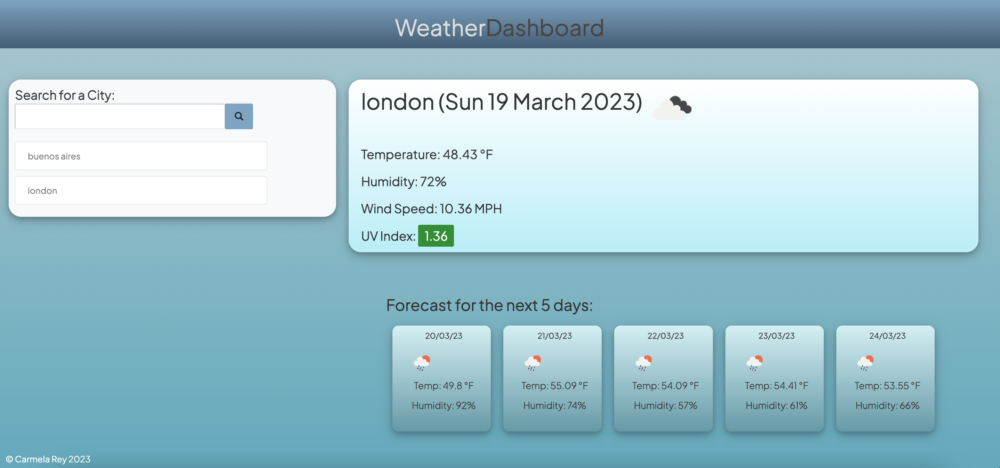

# Weather Dashboard ☀️
Server-Side APIs

A weather dashboaard that allows the user to search for a city and obtain the current weather for that specific city as well as a 5-day weather forecast ☁️

## Built with:
- HTML
- CSS
- JavaScript
- Jquery
- Libraries
- API

## Final Result

 

## Deployment
[Link to Weather App](https://cdrcar.github.io/Weather-App/)

## Libraries:
[Moment.js](https://momentjs.com/)

[Google fonts](https://fonts.google.com/featured)

## API
[OpenWeatherMap](https://openweathermap.org/)

## Author

👤 Carmela Rey

GitHub: [@cdrcar](https://github.com/Cdrcar/)

## 📑 License 
[MIT](https://choosealicense.com/licenses/mit/)